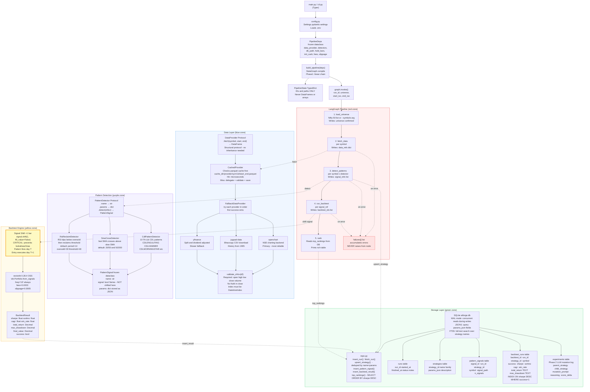
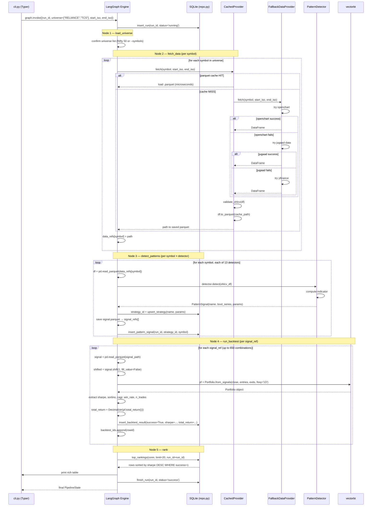
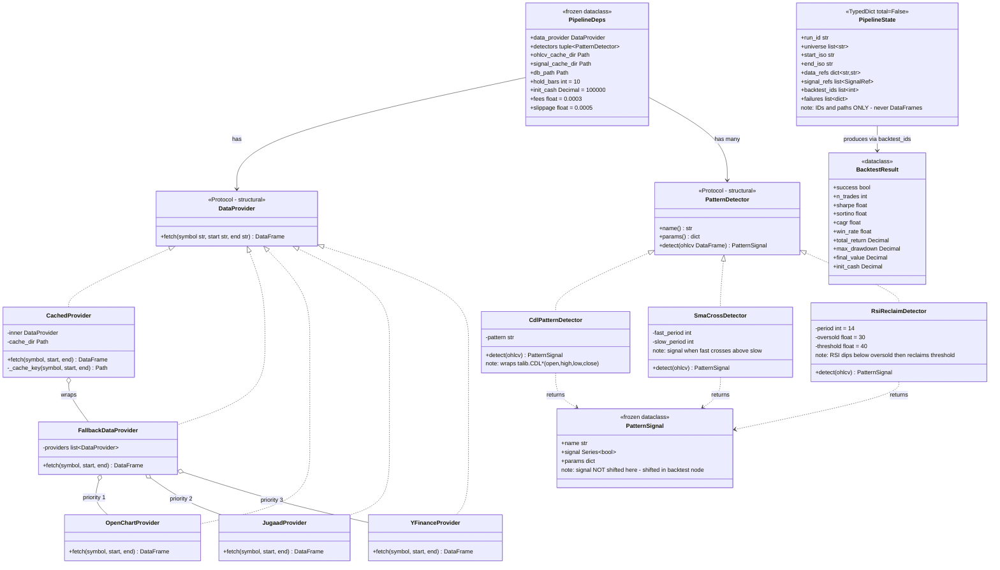
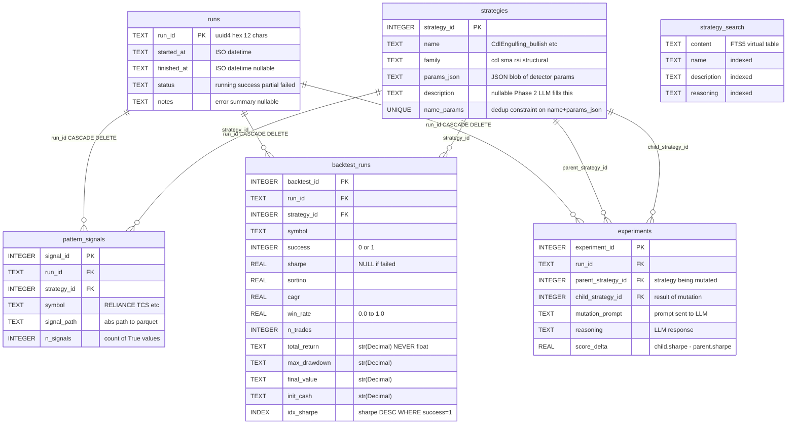

# ATForge — Architecture Reference

> **Living document.** Update this file when the codebase changes.
> Diagrams render in GitHub, VS Code (Markdown Preview), Obsidian, and any Mermaid-compatible viewer.

---

## Diagram 1 — Full System Architecture



---

## Diagram 2 — Execution Sequence (one pipeline run)



---

## Diagram 3 — Class & Protocol Hierarchy



---

## Diagram 4 — SQLite Schema (ER Diagram)



---

## Diagram 5 — LangGraph State Flow

```mermaid
stateDiagram-v2
    [*] --> load_universe : graph.invoke(run_id, universe, start_iso, end_iso)

    state load_universe {
        [*] --> universe_ready : expand Nifty 50 if universe empty
        universe_ready --> [*]
    }

    state fetch_data {
        [*] --> per_symbol
        state per_symbol {
            [*] --> check_cache
            check_cache --> cache_hit : parquet exists
            check_cache --> network_fetch : cache miss
            network_fetch --> try_openchart
            try_openchart --> success : OK
            try_openchart --> try_jugaad : fails
            try_jugaad --> success : OK
            try_jugaad --> try_yfinance : fails
            try_yfinance --> success : OK
            try_yfinance --> add_failure : all fail
            success --> validate_save : validate_ohlcv() + to_parquet()
            validate_save --> data_ref_stored
            cache_hit --> data_ref_stored
            data_ref_stored --> [*]
            add_failure --> [*]
        }
    }

    state detect_patterns {
        [*] --> per_symbol_detector
        state per_symbol_detector {
            [*] --> run_detector : detector.detect(ohlcv_df)
            run_detector --> save_signal : signal.to_parquet()
            save_signal --> upsert_strategy : DB dedup by name+params
            upsert_strategy --> append_signal_ref
            append_signal_ref --> [*]
        }
    }

    state run_backtest {
        [*] --> per_signal_ref
        state per_signal_ref {
            [*] --> shift_signal : signal.shift(1, fill_value=False)
            shift_signal --> vbt_simulate : Portfolio.from_signals(freq=1D)
            vbt_simulate --> extract_metrics : sharpe sortino cagr win_rate
            extract_metrics --> decimal_money : Decimal for all money fields
            decimal_money --> insert_db : insert_backtest_result()
            insert_db --> [*]
            vbt_simulate --> record_failure : on exception
            record_failure --> [*]
        }
    }

    state rank {
        [*] --> query_db : SELECT sharpe DESC WHERE success=1
        query_db --> print_table : rich table to terminal
        print_table --> [*]
    }

    load_universe --> fetch_data : state has universe[]
    fetch_data --> detect_patterns : state has data_refs{}
    detect_patterns --> run_backtest : state has signal_refs[]
    run_backtest --> rank : state has backtest_ids[]
    rank --> [*] : final PipelineState + DB populated
```



---

## Diagram 6 — Phase Roadmap

```mermaid
flowchart LR
    subgraph P1["Phase 1 — Foundation  COMPLETE"]
        direction TB
        p1a["Data pipeline\n3 providers + parquet cache"]
        p1b["13 pattern detectors\n10 CDL + 2 SMA + 1 RSI"]
        p1c["vectorbt backtesting\n+1 bar shift invariant"]
        p1d["SQLite storage\nWAL + JSON1 + FTS5"]
        p1e["LangGraph linear graph\n5 nodes, pure functions"]
        p1f["Streamlit dashboard\n4 tabs + candlestick charts"]
        p1g["45 passing tests"]
        p1a --> p1b --> p1c --> p1d
    end

    subgraph P2a["Phase 2a — Evolution Loop  COMPLETE"]
        direction TB
        p2a["LLM mutation loop\nGemini 2.5 Flash primary\nGroq burst + OpenRouter + Ollama fallback"]
        p2c["AutoResearch ratchet\n5-gate acceptance criterion\nΔsharpe Δsortino dd_ratio n_trades symbol_guard"]
        p2e["LangGraph Send API\nparallel backtest fan-out\nN workers per generation"]
        p2f["Langfuse tracing\nevery LLM call traced"]
        p2g["ParamDeltaMutator\nSMA + RSI param changes"]
        p2h["CompositionMutator\nAND/OR of top-2 parents"]
        p2i["experiments table\naccept/reject + composite_score JSON"]
        p2j["Dashboard evolution tab\nSharpe progression + ratchet pie"]
        p2a --> p2c
        p2g & p2h --> p2c
    end

    subgraph P2b["Phase 2b — Evolution Scale  DEFERRED"]
        direction TB
        p2b["OpenEvolve population\nIsland-based diversity management"]
        p2d["Qdrant similarity dedup\nembeddings to skip near-duplicates"]
        p2k["Bootstrap significance\nstatistical gate in ratchet"]
        p2l["Per-symbol ratchet\nfull per-symbol pass/fail"]
        p2m["Structural patterns\ncup-and-handle H&S double tops"]
    end

    subgraph P3["Phase 3 — HITL and Execution"]
        direction TB
        p3a["Telegram approval bot\none-click approve or reject"]
        p3b["Paper trading wrapper\nZerodha Kite mock orders"]
        p3c["Walk-forward validation\nout-of-sample gate before live"]
        p3d["Statistical significance\nmin n_trades min Sharpe gates"]
        p3a --> p3b --> p3c --> p3d
    end

    subgraph P4["Phase 4 — Scale"]
        direction TB
        p4a["Multi-strategy portfolio\ncorrelation-aware allocation"]
        p4b["Regime detection\nbull bear sideways routing"]
        p4c["Langfuse custom dashboards\nKPIs and experiment tracking"]
        p4d["GitHub cleanup\ntechnical writeup"]
    end

    P1 --> P2a --> P2b --> P3 --> P4

    style P1 fill:#f0fdf4,stroke:#22c55e,stroke-width:2px
    style P2a fill:#f0fdf4,stroke:#22c55e,stroke-width:2px
    style P2b fill:#eff6ff,stroke:#4a9eed,stroke-width:2px
    style P3 fill:#fff7ed,stroke:#f59e0b,stroke-width:2px
    style P4 fill:#fdf4ff,stroke:#8b5cf6,stroke-width:2px
```



---

## What ATForge Does

Downloads daily OHLCV data for NSE Nifty 50 stocks, detects chart patterns programmatically, backtests every (symbol × pattern) combination historically, stores ranked results in SQLite, and (Phase 2+) uses LLMs to mutate and improve strategy parameters overnight. Human approval gates every trade before execution.

---

## Phase Map

| Phase | Status | Scope |
|---|---|---|
| 1 — Foundation | **Complete** | Data → Detect → Backtest → Rank → Dashboard |
| 2a — Evolution Loop | **Complete** | LLM mutation + Send fan-out + ratchet + multi-gen loop |
| 2b — Evolution Scale | Deferred | OpenEvolve population + Qdrant dedup + bootstrap significance |
| 3 — HITL & Execution | Planned | Telegram approval + paper trading + Kite broker |
| 4 — Scale | Planned | Multi-strategy portfolio + regime-aware selection |

---

## Full Execution Trace

```
uv run python main.py pipeline --symbols RELIANCE,TCS --lookback 1y
```

### Step 1 — CLI Entry (`src/atforge/cli.py`)

`typer` parses `--symbols` and `--lookback`. `_apply_lookback("1y")` converts to ISO dates:
- `end_iso = today`
- `start_iso = today - 365 days`

If `--symbols` omitted, `load_universe()` returns full Nifty 50 list.

### Step 2 — Settings (`src/atforge/config.py`)

```python
from atforge.config import settings
settings.db_path    # data/atforge.db
settings.cache_dir  # data/cache/
```

`pydantic-settings` loads `.env` at repo root. `settings.ensure_dirs()` creates `data/` and `data/cache/` if missing.

### Step 3 — Build Dependencies (`src/atforge/cli.py::_build_default_provider`)

```python
deps = PipelineDeps(
    data_provider = CachedProvider(
        FallbackDataProvider([openchart, jugaad, yfinance]),
        cache_dir=settings.cache_dir / "ohlcv"
    ),
    detectors = _default_detectors(),   # 13 detectors
    db_path = settings.db_path,
    hold_bars = 10,
    init_cash = Decimal("100000"),
    fees = 0.0003,
    slippage = 0.0005,
)
```

`_build_default_provider()` wraps each provider in try/except — openchart failing (NSE network down) doesn't abort startup; jugaad + yfinance still work.

### Step 4 — Compile Graph (`src/atforge/graph/pipeline.py`)

```python
graph = build_pipeline(deps)
# Returns a LangGraph CompiledStateGraph
```

Internally: `StateGraph(PipelineState)` → add 5 nodes → add edges → `.compile()`. The compiled graph is a callable that accepts `PipelineState` dict.

### Step 5 — Invoke Pipeline (`src/atforge/cli.py`)

```python
result = graph.invoke({
    "run_id": uuid4().hex[:12],
    "universe": ["RELIANCE", "TCS"],
    "start_iso": "2024-04-28",
    "end_iso":   "2025-04-28",
})
```

LangGraph executes nodes in sequence: `load_universe → fetch_data → detect_patterns → run_backtest → rank`.

### Step 6 — `load_universe` node

Receives `universe` list from state (already set by CLI). If empty, queries NSE for Nifty 50 constituents. Returns state with `universe` confirmed.

### Step 7 — `fetch_data` node (`src/atforge/graph/nodes.py::make_fetch_data`)

For each symbol in `universe`:
1. Call `deps.data_provider.fetch(symbol, start_iso, end_iso)` → returns DataFrame
2. `CachedProvider` checks `data/cache/ohlcv/{provider}/{symbol}/1d/{start}_{end}.parquet`
3. Cache hit → load parquet (microseconds). Cache miss → call `FallbackDataProvider`
4. `FallbackDataProvider` tries openchart first, then jugaad-data, then yfinance
5. Result passes through `validate_ohlcv()` — checks required columns, no NaN close
6. Saves parquet to cache for next run
7. State gets `data_refs = {"RELIANCE": "/path/to/RELIANCE_abc123.parquet", ...}`

On any failure: appended to `state["failures"]`, symbol skipped — never raises.

### Step 8 — `detect_patterns` node

For each `(symbol, detector)` pair:
1. Load OHLCV from `data_refs[symbol]` path
2. Call `detector.detect(ohlcv)` → returns `PatternSignal`
3. `PatternSignal.signal` is a boolean `pd.Series` aligned to OHLCV index
4. Signal saved to `data/cache/signals/{symbol}_{strategy}_{run_id}.parquet`
5. Strategy upserted to `strategies` table (deduped by name+params)
6. `signal_refs` list grows: one `SignalRef` per (symbol, detector)

### Step 9 — `run_backtest` node

For each `signal_ref` in `signal_refs`:
1. Load OHLCV and signal parquet
2. **CRITICAL: shift signal +1 bar** — `signal.shift(1, fill_value=False)` — prevents lookahead bias
3. Convert bool series → entry/exit via `_bool_to_entry_exit()`
4. `vbt.Portfolio.from_signals(ohlcv["close"], entries, exits, freq="1D", fees=0.0003, slippage=0.0005, init_cash=100_000)`
5. Extract metrics: sharpe, sortino, CAGR, win_rate, max_drawdown, total_return
6. Money (total_return, final_value, max_drawdown) stored as `str(Decimal)` — never float
7. `BacktestResult` written to `backtest_runs` table via `insert_backtest_result()`
8. On any error: `success=False` written to DB, backtest_ids grows, never raises

### Step 10 — `rank` node

1. Calls `top_rankings(conn, limit=20)` — SQL sorts by `sharpe DESC WHERE success=1`
2. Prints rich table to terminal with all metrics
3. Returns final state

### Step 11 — Dashboard (optional)

```bash
uv run streamlit run dashboard.py
```

- Tab 1 (Rankings): reads `top_rankings()` from SQLite, renders sortable table + Sharpe bar chart
- Tab 2 (OHLCV+Signals): scans `data/cache/**/*.parquet`, renders candlestick + signal overlay
- Tab 3 (Run History): per-run backtest counts
- Tab 4 (DB Stats): table row counts, cache sizes

---

## Component Deep-Dives

### Data Layer (`src/atforge/data/`)

**`DataProvider` Protocol** — structural protocol (no inheritance needed):
```python
class DataProvider(Protocol):
    def fetch(self, symbol: str, start: str, end: str) -> pd.DataFrame: ...
```

Any class with a `.fetch()` method satisfying the signature is a valid provider.

**`CachedProvider`** wraps any `DataProvider`:
- Cache key: `{cache_dir}/{provider_name}/{symbol}/1d/{start}_{end}.parquet`
- On miss: delegates to inner provider, validates, saves parquet, returns DataFrame
- On hit: `pd.read_parquet(path)` — bypasses network entirely
- Important: the cache stores data from the *inner* provider's perspective. Multiple symbols with overlapping date ranges each get their own file.

**`FallbackDataProvider`** wraps a list of providers:
```python
for provider in self.providers:
    try:
        return provider.fetch(symbol, start, end)
    except Exception:
        continue
raise DataFetchError(f"All providers failed for {symbol}")
```
Priority: openchart (NSE's charting backend, most reliable) → jugaad-data (bhavcopy CSV, ~1995 history) → yfinance (split-adjusted, slower).

**`validate_ohlcv(df)`** — contract enforced at boundary:
- Required columns: `open`, `high`, `low`, `close`, `volume`
- No NaN in `close`
- Index is DatetimeIndex
- Raises `ValueError` on violation — never returns invalid data

---

### LangGraph Pipeline (`src/atforge/graph/`)

**`PipelineState`** — TypedDict with `total=False` (all keys optional):
```python
class PipelineState(TypedDict, total=False):
    run_id: str
    universe: list[str]
    start_iso: str
    end_iso: str
    generation: int                     # current generation (0-based); Phase 2a
    max_generations: int                # stop when generation >= this; Phase 2a
    detector_configs: list[dict]        # last-writer-wins; Phase 2a
    data_refs: dict[str, str]          # {symbol: "/abs/path/to.parquet"}
    signal_refs: Annotated[list[SignalRef], operator.add]  # reducer — delta-only
    backtest_ids: Annotated[list[int], operator.add]       # reducer — delta-only
    failures: Annotated[list[dict], operator.add]          # reducer — delta-only
    mutations: Annotated[list[dict], operator.add]         # reducer — delta-only; Phase 2a
```

**The IDs-only invariant**: Never put DataFrames, arrays, or Portfolio objects in state. LangGraph checkpoints state on every node transition. A 50-symbol OHLCV DataFrame at 10 years = ~15MB. With 5 nodes × 50 symbols that's 3.75GB of checkpoint data. Parquet paths are 50 bytes.

**Reducers vs last-writer-wins**: `signal_refs`, `backtest_ids`, `failures`, `mutations` use `operator.add` — each node returns only the NEW items it produced. `detector_configs` is last-writer-wins — `advance_generation` overwrites it each loop with accepted child configs.

**`PipelineDeps`** — frozen dataclass injected at graph construction:
```python
@dataclass(frozen=True)
class PipelineDeps:
    data_provider: DataProvider
    detectors: tuple[PatternDetector, ...]  # seeds generation 0 only
    ohlcv_cache_dir: Path
    signal_cache_dir: Path
    db_path: Path
    hold_bars: int = 5
    init_cash: Decimal = Decimal("100000")
    fees: float = 0.0003
    slippage: float = 0.0005
    # Phase 2a additions:
    mutators: tuple[Mutator, ...] = ()
    ratchet_thresholds: RatchetThresholds = field(default_factory=RatchetThresholds)
    top_n_parents: int = 5
```

Note: `deps.detectors` seeds `state["detector_configs"]` on generation 0 only. In subsequent generations, `advance_generation` overwrites `detector_configs` with accepted child configs. Node code always reads from `state["detector_configs"]`, never from `deps.detectors`.

**Node factory pattern** — nodes are closures over `deps`:
```python
def make_fetch_data(deps: PipelineDeps) -> Callable[[PipelineState], dict]:
    def fetch_data(state: PipelineState) -> dict:
        # deps is captured in closure — no global state
        ...
    return fetch_data
```

This makes testing trivial: `make_fetch_data(PipelineDeps(data_provider=SyntheticProvider()))`.

**Phase 1 graph** (linear chain):
```
START → load_universe → fetch_data → detect_patterns → run_backtest → rank → END
```

**Phase 2a graph** (evolution loop with Send fan-out — already built):
```
START → load_universe → fetch_data → detect_patterns
  → [Send×N] run_backtest_one   ← parallel per signal_ref
  → rank → mutate_strategies → ratchet_node
  → loop_decision
      "continue" → advance_generation → detect_patterns  (loop back)
      "stop"     → END
```

`max_generations=1` (default) means `loop_decision` always returns `"stop"` — identical behavior to Phase 1. `max_generations=N` runs N generations of evolution.

**Phase 3 HITL** (planned): `build_pipeline(deps, interrupt_before=["rank"])` — checkpoints between ratchet and ranking for human review. Cheap because state is IDs only.

---

### Pattern Detection (`src/atforge/patterns/`)

**`PatternDetector` Protocol**:
```python
class PatternDetector(Protocol):
    @property
    def name(self) -> str: ...
    @property
    def params(self) -> dict: ...
    def detect(self, ohlcv: pd.DataFrame) -> PatternSignal: ...
```

**`PatternSignal`** — frozen dataclass:
```python
@dataclass(frozen=True)
class PatternSignal:
    name: str                    # strategy name for DB dedup
    signal: pd.Series            # bool, aligned to ohlcv.index
    params: dict                 # stored as JSON in strategies table
```

Signal is NOT shifted here. Shifting happens in the backtest node. This keeps pattern detection pure and independently testable.

**4 detector implementations** (Phase 1):

| Class | What it detects |
|---|---|
| `CdlPatternDetector` | One of 10 TA-Lib CDL* patterns (CDLENGULFING, CDLHAMMER, etc.) |
| `SmaCrossDetector` | `fast_period` SMA crosses above `slow_period` SMA |
| `RsiReclaimDetector` | RSI dips below `oversold` then crosses back above `threshold` |
| `(Phase 2+)` | Structural patterns via scipy.signal.find_peaks |

**`_default_detectors()`** builds 13 detectors:
- 10 × `CdlPatternDetector` (one per CDL pattern)
- 2 × `SmaCrossDetector` (20/50 and 50/200)
- 1 × `RsiReclaimDetector` (RSI 14, oversold=30, threshold=40)

---

### Backtest Engine (`src/atforge/backtest/`)

**The +1 bar shift** is the most critical invariant in the system:
```python
entries = signal.shift(1, fill_value=False)
```

Without this shift, vectorbt uses today's close to generate a signal AND enters on today's close — lookahead bias. With the shift, today's signal triggers tomorrow's entry. This is a hard rule, not a preference.

**`_bool_to_entry_exit(signal)`** converts a boolean Series to separate entry/exit signals:
- Entry: `True` bars (after shift) where previous bar was `False`
- Exit: `False` bars where previous bar was `True` (OR hold_bars exceeded)
- `fill_value=False` ensures the first bar is never an entry/exit artifact

**`run_backtest(signal_ref, deps)`**:
```python
pf = vbt.Portfolio.from_signals(
    close=ohlcv["close"],
    entries=entries,
    exits=exits,
    freq="1D",           # always 1D for daily data
    fees=deps.fees,
    slippage=deps.slippage,
    init_cash=float(deps.init_cash),
)
```

**`BacktestResult`** metric types:

| Field | Type | Why |
|---|---|---|
| `total_return` | `Decimal` | Money — no float rounding |
| `final_value` | `Decimal` | Money |
| `max_drawdown` | `Decimal` | Money (peak-to-trough in cash) |
| `init_cash` | `Decimal` | Money |
| `sharpe` | `float` | Ratio — analytical, not financial |
| `sortino` | `float` | Ratio |
| `cagr` | `float` | Ratio |
| `win_rate` | `float` | Ratio (0.0-1.0) |
| `n_trades` | `int` | Count |
| `success` | `bool` | False if vectorbt raised |

On failure: `BacktestResult(success=False, ...)` returned and written to DB. The caller (run_backtest node) appends to `failures[]`. Never raises.

---

### Storage Layer (`src/atforge/storage/`)

**SQLite configuration** (`db.py::_configure_connection`):
```sql
PRAGMA journal_mode=WAL;      -- concurrent reads during writes
PRAGMA foreign_keys=ON;       -- cascade deletes
PRAGMA synchronous=NORMAL;    -- safe but not slow
```

WAL mode means the Streamlit dashboard can read while the pipeline is writing — no locking.

**Schema** (`storage/schema.sql`):

```
runs            — one row per pipeline invocation
                  (run_id, started_at, finished_at, status, notes)

strategies      — deduped by (name, params_json)
                  same CDL pattern across 50 symbols = 1 row here

pattern_signals — one row per (run, strategy, symbol)
                  links run → strategy → symbol, stores signal metadata

backtest_runs   — one row per backtest result
                  money as TEXT (str(Decimal)), ratios as REAL

experiments     — Phase 2 LLM mutation log (scaffolded, empty in Phase 1)

strategy_search — FTS5 virtual table over strategy names/descriptions
                  Phase 2 fills this when LLM adds reasoning text
```

**Money storage invariant**:
```python
# Writing
conn.execute("INSERT ... total_return=?", (str(result.total_return),))

# Reading
total_return = Decimal(row["total_return"])
```

Never `float(row["total_return"])`. Float loses precision on large values (₹10,00,000.37 becomes ₹10,00,000.375).

**`txn()` context manager** — all writes use explicit transactions:
```python
with connect(db_path) as conn:
    with txn(conn):           # BEGIN
        insert_run(conn, run_id)
        upsert_strategy(conn, ...)
    # COMMIT on exit, ROLLBACK on exception
```

`connect()` uses `isolation_level=None` (autocommit mode). Without `txn()`, every INSERT auto-commits individually — slow and non-atomic.

**`top_rankings(conn, limit, run_id)`** — the query powering Tab 1 of dashboard:
```sql
-- ROW_NUMBER() dedup: one row per (symbol, strategy) — keeps highest Sharpe only.
-- Without this, multi-generation runs show the same baseline strategy once per
-- generation it was tested in, cluttering rankings with near-identical rows.
SELECT backtest_id, run_id, symbol, strategy_name, family,
       generation, n_trades, total_return, final_value, max_drawdown,
       sharpe, sortino, cagr, win_rate
FROM (
    SELECT b.backtest_id, b.run_id, b.symbol,
           s.name AS strategy_name, s.family,
           b.generation, b.n_trades, b.total_return, b.final_value, b.max_drawdown,
           b.sharpe, b.sortino, b.cagr, b.win_rate,
           ROW_NUMBER() OVER (
               PARTITION BY b.symbol, b.strategy_id
               ORDER BY b.sharpe DESC
           ) AS rn
    FROM backtest_runs b
    JOIN strategies s ON s.strategy_id = b.strategy_id
    WHERE b.success = 1 AND (? IS NULL OR b.run_id = ?)
)
WHERE rn = 1
ORDER BY sharpe DESC
LIMIT ?
```

Index on `backtest_runs(sharpe DESC) WHERE success=1` makes this fast at 10k+ rows.

---

## Key Design Decisions

### Why LangGraph for a linear pipeline?

Phase 1 is linear but Phase 2 needs `Send()` fan-out (one message per signal_ref → parallel backtests), HITL interrupts, and LLM nodes. Implementing this in plain Python would require a rewrite. LangGraph's graph model supports all three without changing node code — just change wiring. The overhead is minimal; the optionality is free.

### Why no DataFrames in state?

LangGraph checkpoints state to memory (and optionally disk) after every node. A single OHLCV DataFrame for RELIANCE at 10 years is ~1.5MB. With 50 symbols across 5 nodes that's 375MB of checkpoint overhead per run. Parquet paths are 60 bytes. Phase 3 adds `interrupt_before=["rank"]` for HITL — that checkpoint must be small enough to survive a process restart.

### Why SQLite over Postgres?

This runs on a MacBook, overnight, alone. SQLite with WAL handles 10k+ writes/second — orders of magnitude beyond what ATForge needs. Zero infrastructure: no Docker, no server, no connection pooling. The `uvx datasette data/atforge.db` trick gives a full web UI in 2 seconds. Qdrant (cloud, free tier) handles the vector search that SQLite can't.

### Why Decimal for money?

```python
>>> 0.1 + 0.2
0.30000000000000004
>>> Decimal("0.1") + Decimal("0.2")
Decimal('0.3')
```

Backtests over years with thousands of trades accumulate rounding errors. ₹1 crore portfolio tracking: float error compounds to ₹100+ differences. All money columns are stored as `TEXT` holding `str(Decimal)` and round-trip as `Decimal(row_value)`.

### Why the +1 bar shift is mandatory

vectorbt's `from_signals` uses the signal date's close price as the entry price. If pattern detection runs on today's OHLCV and produces a signal for today, and vectorbt enters at today's close — that's impossible in practice (you'd need to know today's close before end of day). Shifting by 1 means: pattern fires on day T, entry executes on day T+1 open (proxied by T+1 close with slippage). This matches how live trading would work.

### Why factory functions instead of node classes?

```python
# Factory (actual code)
def make_fetch_data(deps: PipelineDeps) -> NodeFn:
    def fetch_data(state: PipelineState) -> dict:
        ...  # deps captured in closure
    return fetch_data

# Test
node = make_fetch_data(PipelineDeps(data_provider=SyntheticProvider()))
result = node({"universe": ["RELIANCE"], "start_iso": "2024-01-01", ...})
```

Pure functions over TypedDict state are trivially testable. No mocking required — just inject a different `deps`. Classes would require either global state or complex DI frameworks.

---

## Useful Commands

```bash
# Single-pass baseline (equivalent to Phase 1)
uv run python main.py pipeline --symbols RELIANCE,TCS,INFY --lookback 1y

# Single symbol quick test
uv run python main.py pipeline --symbols RELIANCE --lookback 6m

# 3-generation evolution run
uv run python main.py pipeline --symbols RELIANCE,TCS --lookback 1y \
  --max-generations 3 --mutators param_delta,composition --top-n-parents 5

# Dry-run (ratchet fires but skips experiments table writes)
uv run python main.py pipeline --symbols RELIANCE --max-generations 2 --dry-run

# LLM provider control
uv run python main.py pipeline --symbols RELIANCE \
  --llm-priority gemini,groq,openrouter --enable-ollama false

# Show ratchet verdicts for a run
uv run python main.py experiments --run <run_id>

# View rankings
uv run python main.py rank --top 20 --run <run_id>

# Inspect a run (metadata + failure summary)
uv run python main.py inspect <run_id>

# Dashboard (5 tabs: Rankings, OHLCV+Signals, Run History, DB Stats, Evolution)
uv run streamlit run dashboard.py

# DB web UI
uvx datasette data/atforge.db

# Tests (175 pass in Phase 2a)
uv run pytest -q

# Lint + format
uv run ruff check --fix && uv run ruff format

# Raw SQL — top strategies
sqlite3 data/atforge.db "SELECT symbol, sharpe FROM backtest_runs b JOIN strategies s USING(strategy_id) WHERE success=1 ORDER BY sharpe DESC LIMIT 10;"

# Raw SQL — accepted mutations
sqlite3 data/atforge.db "SELECT * FROM experiments WHERE accepted=1 ORDER BY delta_sharpe DESC;"

# Raw SQL — generation breakdown
sqlite3 data/atforge.db "SELECT generation, COUNT(*) FROM backtest_runs WHERE run_id='<run_id>' GROUP BY generation;"
```

---

## Extension Recipes

### Add a new pattern detector (Phase 1 compatible)

```python
# src/atforge/patterns/detectors.py
@dataclass
class BollingerSqueezeDetector:
    period: int = 20
    num_std: float = 2.0

    @property
    def name(self) -> str:
        return f"BBSQUEEZE_{self.period}_{self.num_std}"

    @property
    def params(self) -> dict:
        return {"period": self.period, "num_std": self.num_std}

    def detect(self, ohlcv: pd.DataFrame) -> PatternSignal:
        # compute squeeze logic
        signal = ...  # bool Series, NOT shifted
        return PatternSignal(name=self.name, signal=signal, params=self.params)
```

Then add to `_default_detectors()` in `cli.py`. No other changes needed.

### Add a new data provider (Phase 1 compatible)

```python
# src/atforge/data/providers.py
class AngelOneProvider:
    def fetch(self, symbol: str, start: str, end: str) -> pd.DataFrame:
        # call AngelOne API
        df = ...
        return validate_ohlcv(df)
```

Add to `FallbackDataProvider([..., AngelOneProvider()])` in `_build_default_provider()`. No other changes.

### Add Send API fan-out (Phase 2)

```python
# In pipeline.py
from langgraph.types import Send

def detect_and_send(state: PipelineState) -> list[Send]:
    # Instead of returning dict, return Send objects
    return [
        Send("run_backtest", {"signal_ref": ref})
        for ref in state["signal_refs"]
    ]

graph.add_conditional_edges("detect_patterns", detect_and_send)
```

`make_run_backtest` already operates on one `signal_ref` — no node changes needed.

### Add HITL interrupt (Phase 3)

```python
graph = build_pipeline(deps, interrupt_before=["rank"])
# Pipeline pauses at rank, human reviews signal_refs
# Resume:
graph.invoke(None, config={"configurable": {"thread_id": run_id}})
```

### Add LLM node (Phase 2)

```python
def make_mutate_strategies(deps: PipelineDeps) -> NodeFn:
    def mutate_strategies(state: PipelineState) -> dict:
        from atforge.llm.client import complete, LlmRequest
        # read top_rankings, ask LLM to suggest param mutations
        response = complete(LlmRequest(
            prompt=f"Top strategies: {rankings}. Suggest 5 parameter mutations.",
            trace_name="mutate_strategies"
        ))
        # parse mutations, add to next run's detectors
        ...
    return mutate_strategies

# Wire between rank and END:
graph.add_node("mutate", make_mutate_strategies(deps))
graph.add_edge("rank", "mutate")
graph.add_edge("mutate", END)
```

---

## File Map

```
ATForge/
├── main.py                          Entry point
├── dashboard.py                     Streamlit 4-tab dashboard
├── CLAUDE.md                        Claude Code project instructions
├── CONTEXT.md                       Vision + tool choices + phase plan
├── ARCHITECTURE.md                  This file
├── pyproject.toml                   Dependencies + scripts
├── .env                             API keys (not committed)
│
├── src/atforge/
│   ├── config.py                    Settings (pydantic-settings)
│   ├── cli.py                       Typer CLI: pipeline, rank, inspect
│   ├── CLAUDE.md                    Module-level Claude instructions
│   │
│   ├── data/
│   │   ├── provider.py              DataProvider Protocol + validate_ohlcv
│   │   ├── cached.py                CachedProvider (parquet cache)
│   │   ├── fallback.py              FallbackDataProvider
│   │   ├── openchart_provider.py    NSE charting backend
│   │   ├── jugaad_provider.py       Bhavcopy CSV
│   │   ├── yfinance_provider.py     Yahoo Finance (split-adjusted)
│   │   └── CLAUDE.md
│   │
│   ├── patterns/
│   │   ├── base.py                  PatternDetector Protocol, PatternSignal
│   │   ├── detectors.py             CdlPattern, SmaCross, RsiReclaim
│   │   └── CLAUDE.md
│   │
│   ├── backtest/
│   │   ├── engine.py                run_backtest, BacktestResult
│   │   └── CLAUDE.md
│   │
│   ├── storage/
│   │   ├── db.py                    connect(), txn(), init_db()
│   │   ├── repo.py                  insert_run, upsert_strategy, top_rankings
│   │   ├── schema.sql               Table definitions
│   │   └── CLAUDE.md
│   │
│   ├── graph/
│   │   ├── state.py                 PipelineState TypedDict, SignalRef
│   │   ├── deps.py                  PipelineDeps frozen dataclass
│   │   ├── nodes.py                 make_*() factory functions
│   │   ├── pipeline.py              build_pipeline() → CompiledStateGraph
│   │   └── CLAUDE.md
│   │
│   └── llm/
│       ├── client.py                complete() — Phase 1: raises NotImplementedError
│       └── CLAUDE.md
│
├── tests/
│   ├── data/test_provider.py        validate_ohlcv, CachedProvider, fallback
│   ├── patterns/test_detectors.py   all 3 detector types
│   ├── backtest/test_engine.py      shift invariant, Decimal round-trip
│   ├── storage/test_repo.py         WAL, upsert dedup, cascade delete
│   └── graph/test_pipeline.py       E2E with SyntheticProvider, partial failure
│
└── data/                            (gitignored)
    ├── atforge.db                   SQLite database
    └── cache/
        ├── ohlcv/                   Parquet files per provider/symbol
        └── signals/                 Signal parquets per symbol/strategy/run
```

---

## Phase 2a — Evolution Loop (complete)

### Pipeline topology

```
START
  → load_universe        seeds detector_configs from deps.detectors
  → fetch_data
  → detect_patterns      uses state["detector_configs"] via build_detector_from_config()
  → [Send×N] run_backtest_one    parallel worker per signal_ref
  → rank
  → mutate_strategies    proposes child strategies via LLM mutators
  → ratchet_node         compares child vs parent, writes experiments rows
  → loop_decision ──── "continue" → advance_generation → detect_patterns
                └────── "stop"    → END
```

`loop_decision` returns `"continue"` if `generation + 1 < max_generations`, else `"stop"`. Default `max_generations=1` = single pass identical to Phase 1.

### PipelineState — Phase 2a fields

| Field | Type | Merge strategy | Description |
|---|---|---|---|
| `run_id` | `str` | last-writer-wins | uuid4 hex 12 chars |
| `universe` | `list[str]` | last-writer-wins | symbol list |
| `start_iso`, `end_iso` | `str` | last-writer-wins | ISO date range |
| `generation` | `int` | last-writer-wins | current generation (0-based) |
| `max_generations` | `int` | last-writer-wins | stop when generation >= this |
| `detector_configs` | `list[dict]` | **last-writer-wins** | active DetectorConfigs for next detect_patterns |
| `data_refs` | `dict[str, str]` | last-writer-wins | {symbol: parquet path} |
| `signal_refs` | `Annotated[list, operator.add]` | **reducer** | accumulated per (symbol, detector) |
| `backtest_ids` | `Annotated[list, operator.add]` | **reducer** | DB rowids from run_backtest_one workers |
| `failures` | `Annotated[list, operator.add]` | **reducer** | delta-only failure dicts |
| `mutations` | `Annotated[list, operator.add]` | **reducer** | proposed child mutations, all generations |

Reducer fields: each node returns only its NEW items. LangGraph merges via `operator.add`. `detector_configs` is last-writer-wins — `advance_generation` overwrites it each loop.

### PipelineDeps — Phase 2a additions

| Field | Type | Default | Description |
|---|---|---|---|
| `mutators` | `tuple[Mutator, ...]` | `()` | `ParamDeltaMutator`, `CompositionMutator` |
| `ratchet_thresholds` | `RatchetThresholds` | see below | ratchet acceptance config |
| `top_n_parents` | `int` | `5` | how many parents to mutate per generation |

`RatchetThresholds` defaults: `min_delta_sharpe=0.05`, `min_delta_sortino=0.02`, `max_dd_ratio=1.10`, `min_n_trades=5`.

### Ratchet acceptance criterion

Child is accepted if **all five** conditions hold:

```
child.mean_sharpe - parent.mean_sharpe   ≥  min_delta_sharpe        (default 0.05)
child.mean_sortino - parent.mean_sortino ≥  min_delta_sortino        (default 0.02)
child.max_drawdown / parent.max_drawdown ≤  1 + max_drawdown_tol    (default 1.10)
child.total_n_trades                     ≥  min_n_trades             (default 5)
per-symbol regression guard              ≤  max_symbol_regression    (default 0.5)
  → reject if any shared symbol's Sharpe drops by more than 0.5 vs parent
  → only fires when per_symbol_sharpe is populated for both parent and child
  → set max_symbol_regression=inf to disable
```

`composite_score` (stored as JSON in `experiments` table):
```
{delta_sharpe, delta_sortino, dd_ratio, child_n_trades,
 sharpe_ok, sortino_ok, dd_ok, trades_ok, symbol_ok,
 worst_symbol_regression}
```

`build_evaluation_result` aggregates across symbols: AVG(sharpe), AVG(sortino), SUM(n_trades), MAX(max_drawdown), plus a `per_symbol_sharpe` dict `{symbol: sharpe}` used by the per-symbol regression guard. Phase 2b promotes this to a full per-symbol ratchet with bootstrap significance.

`build_evaluation_result` aggregates across symbols: AVG(sharpe), AVG(sortino), SUM(n_trades), MAX(max_drawdown). Phase 2b adds per-symbol ratchet with bootstrap significance.

### Evolution submodule (`src/atforge/evolution/`)

```
types.py          DetectorConfig, StrategyRow, ProposedMutation, EvaluationResult,
                  RatchetThresholds, RatchetVerdict, Mutator Protocol
registry.py       build_detector_from_config(), detector_params_json() — round-trip
prompts.py        Pydantic LLM response schemas: SmaParamsDelta, RsiParamsDelta, CompositionChoice
ratchet.py        build_evaluation_result() (DB I/O), judge_mutation() (pure function)
mutators/
  param_delta.py  ParamDeltaMutator — SMA + RSI families, JSON fence-strip + brace-match fallback
  composition.py  CompositionMutator — pairwise AND/OR, max_nesting_depth=2 guard
```

### LLM submodule (`src/atforge/llm/`)

```
types.py          LlmRequest, LlmResponse, LlmProvider Protocol, error hierarchy
registry.py       ProviderRegistry, build_default_registry(settings)
router.py         complete_with_fallback() — retry+fallback, JSON fence-strip
tracing.py        Langfuse 4.x wrapper — get_client().start_as_current_observation()
providers/
  gemini.py       Gemini 2.5 Flash (primary, 1500 RPD free)
  groq.py         Groq (burst)
  openrouter.py   OpenRouter (diversity, 20+ free models)
  ollama.py       Local Ollama (unlimited, gated by --enable-ollama)
```

### DB schema additions (Phase 2a)

```sql
-- Added to pattern_signals and backtest_runs:
generation INTEGER NOT NULL DEFAULT 0

-- experiments table (fully active):
run_id TEXT, generation INTEGER, parent_strategy_id INT, child_strategy_id INT,
mutator TEXT, mutation_json TEXT, accepted INTEGER,
delta_sharpe REAL, composite_score TEXT, reasoning TEXT

-- New indexes:
idx_exp_run_gen   ON experiments(run_id, generation)
idx_bt_strategy_gen ON backtest_runs(strategy_id, generation)
```

Migration: `storage/migrations/0002_phase2a.sql` — applied automatically by `init_db` via `PRAGMA user_version`.

### Phase 2a file additions

```
src/atforge/
├── evolution/
│   ├── __init__.py
│   ├── types.py
│   ├── registry.py
│   ├── prompts.py
│   ├── ratchet.py
│   ├── CLAUDE.md
│   └── mutators/
│       ├── __init__.py
│       ├── param_delta.py
│       └── composition.py
│
├── patterns/
│   └── composition.py              AndDetector, OrDetector
│
├── llm/
│   ├── types.py
│   ├── registry.py
│   ├── router.py
│   ├── tracing.py
│   └── providers/
│       ├── gemini.py
│       ├── groq.py
│       ├── openrouter.py
│       └── ollama.py
│
├── graph/
│   └── nodes_phase2.py             make_run_backtest_one/dispatcher, make_ratchet_node,
│                                   make_mutate_strategies, make_advance_generation, make_loop_decision
│
└── storage/
    ├── migrate.py
    └── migrations/
        └── 0002_phase2a.sql

tests/
├── evolution/
│   ├── test_registry_roundtrip.py
│   ├── test_param_delta.py
│   ├── test_composition_mutator.py
│   └── test_ratchet.py
├── graph/
│   ├── test_send_fanout.py
│   └── test_mutate_node.py         includes full 2-generation E2E
├── integration/
│   └── test_phase2_pipeline.py
├── patterns/
│   └── test_composition.py
└── storage/
    └── test_migrate.py
```

### Phase 2b (deferred)

- OpenEvolve population/island management
- Qdrant strategy embeddings + similarity dedup
- Bootstrap statistical significance test for ratchet
- Per-symbol ratchet (Phase 2a aggregates across symbols)
- Structural patterns: cup-and-handle, H&S, double tops (scipy.signal, ~200 LOC)
- Full LLM codegen mutator (Phase 3+)
