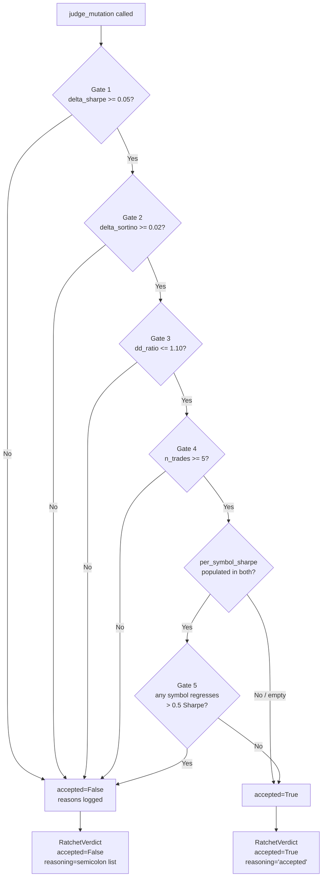

# Evolution Submodule — `src/atforge/evolution/`

## Purpose and design philosophy

This module drives the self-improvement loop: it proposes mutations to trading strategies, scores child backtests against their parents via a ratchet, and records verdicts to the database. It has **no direct LLM I/O** — all LLM callables are injected at construction time via `Callable[[LlmRequest], LlmResponse]`. This keeps the module fully unit-testable with mock routers.

Key design principles:
- Mutators are **pure proposal generators** — they emit `ProposedMutation` configs, never write to DB
- The ratchet (`judge_mutation`) is a **pure function** — no I/O, fully deterministic for given inputs
- DB aggregation (`build_evaluation_result`) is **explicitly separated** from scoring
- Mutations that fail LLM parsing are **silently dropped** — never raise from worker nodes

## File layout

```
evolution/
  types.py              — all shared dataclasses and the Mutator Protocol
  registry.py           — DetectorConfig ↔ PatternDetector round-trip serialization
  ratchet.py            — build_evaluation_result (DB I/O) + judge_mutation (pure)
  prompts.py            — Pydantic response schemas (SmaParamsDelta, RsiParamsDelta,
                          CompositionChoice, ResearchProposal) + prompt template functions
  research_prompts.py   — RESEARCH_SYSTEM prompt + research_initial_message() for ReAct loop
  agent_tools.py        — ToolDefinition dataclass + build_research_tools() (5 read-only DB tools)
  agent_runner.py       — run_react_loop(): multi-turn ReAct loop with tool dispatch + EventBus
  mutators/
    param_delta.py      — ParamDeltaMutator: LLM-guided SMA/RSI parameter tweaks
    composition.py      — CompositionMutator: LLM-guided AND/OR detector combinations
    research_agent.py   — ResearchAgentMutator: ReAct loop + DB tools before proposing
```

## A1 — Research Agent (complete)

`ResearchAgentMutator` (name=`"research"`, enable via `--mutators research`) wraps `run_react_loop`:

```
_propose_one(parent_row)
  → build initial_message with strategy ID + params + performance
  → open sqlite3.Connection to db_path
  → run_react_loop(llm, tools, system, msg, conn, max_iterations=6)
       iteration 0..5:
         LlmRequest(messages=..., tools=tool_specs) → llm_router
         if tool_calls → dispatch → append tool results → next iter
         if no tool_calls → return response.text (final answer)
       if max_iterations hit → forced final turn (no tools, temp=0.3)
  → _parse_json(raw) → ResearchProposal.model_validate(data)
  → child_config + ProposedMutation(reasoning="[research] ... (conf=X.XX)")
```

**5 read-only DB tools available to the agent:**

| Tool name | Calls | Purpose |
|---|---|---|
| `query_top_strategies` | `top_rankings(conn, limit, run_id)` | See best params across all runs |
| `query_strategy_details` | `get_strategy(conn, strategy_id)` | Full config for one strategy |
| `query_strategy_lineage` | `get_mutation_tree(conn, id, max_depth)` | Recursively trace children |
| `query_pattern_performance` | `get_pattern_symbol_breakdown(conn, id)` | Per-symbol avg Sharpe/Sortino |
| `query_recent_experiments` | `get_experiments_for_run(conn, run_id)` | Ratchet verdicts for a run |

**Events emitted:** `EvtAgentToolCall` and `EvtAgentReasoning` per iteration into EventBus.

**Supports:** `sma_crossover` and `rsi_oversold` parents only. CDL and composite parents skipped (same as `ParamDeltaMutator`).

---

## `types.py` — shared type definitions

### `DetectorConfig`

```python
class DetectorConfig(TypedDict, total=False):
    type: str       # required: "sma_crossover" | "rsi_oversold" | "talib_cdl" | "and" | "or"
    # SmaCrossover
    fast: int
    slow: int
    # RsiOversoldReclaim
    period: int
    oversold: int
    # TalibCdlDetector
    cdl_name: str
    direction: str
    # AndDetector / OrDetector (nested)
    left: DetectorConfig
    right: DetectorConfig
```

Leaf example: `{"type": "sma_crossover", "fast": 10, "slow": 25}`
Composite example: `{"type": "and", "left": {"type": "sma_crossover", ...}, "right": {"type": "rsi_oversold", ...}}`

### `StrategyRow`

```python
class StrategyRow(TypedDict):
    strategy_id: int
    name: str
    family: str
    params_json: str        # raw JSON string from DB (use json.loads before inspecting)
    mean_sharpe: float
    mean_sortino: float
    total_n_trades: int
    max_drawdown: str       # str(Decimal) — never float
    generation: int
```

Populated by `get_top_strategies_for_generation()` and passed directly to `Mutator.propose()`.

### `ProposedMutation`

```python
@dataclass(frozen=True)
class ProposedMutation:
    parent_strategy_id: int
    child_config: DetectorConfig    # the new detector config to backtest
    reasoning: str                  # one sentence from LLM
    mutator: str                    # "param_delta" | "composition"
```

Output of `Mutator.propose()`. Fed into the graph's mutate node, which upserts the child strategy and schedules a backtest.

### `EvaluationResult`

```python
@dataclass(frozen=True)
class EvaluationResult:
    strategy_id: int
    run_id: str
    generation: int
    mean_sharpe: float
    mean_sortino: float
    total_n_trades: int
    max_drawdown: Decimal       # max across symbols — Decimal, never float
    n_symbols: int
    per_symbol_sharpe: dict[str, float] = field(default_factory=dict)
    # symbol → sharpe map for per-symbol regression check
    # Empty dict = pre-Phase-2b data; per-symbol guard is skipped when empty
```

`per_symbol_sharpe` is populated by `build_evaluation_result` from the `symbol` column in `backtest_runs`. It is empty for rows inserted before Phase 2a.

### `RatchetThresholds`

```python
@dataclass(frozen=True)
class RatchetThresholds:
    min_delta_sharpe: float = 0.05
    min_delta_sortino: float = 0.02
    max_drawdown_tol: float = 0.10    # child_dd <= parent_dd * (1 + tol)
    min_n_trades: int = 5
    max_symbol_regression: float = 0.5
    # Per-symbol guard: reject if any shared symbol's Sharpe drops > 0.5 vs parent
    # Set to float("inf") to disable. Only active when per_symbol_sharpe is populated.
```

These defaults are overridden by `PipelineDeps.ratchet_thresholds`, which reads from `config.py` settings. CLI flags `--ratchet-*` flow through `settings` into `RatchetThresholds`.

### `RatchetVerdict`

```python
@dataclass(frozen=True)
class RatchetVerdict:
    accepted: bool
    delta_sharpe: float
    delta_sortino: float
    dd_ratio: float         # float OK — analytical ratio, not money
    composite_score: dict[str, float]
    reasoning: str          # "accepted" or semicolon-separated failure reasons
```

`composite_score` keys: `delta_sharpe`, `delta_sortino`, `dd_ratio`, `child_n_trades`, `sharpe_ok`, `sortino_ok`, `dd_ok`, `trades_ok`, `symbol_ok`, `worst_symbol_regression`. All values are `float`.

### `MutationRecord`

```python
@dataclass(frozen=True)
class MutationRecord:
    run_id: str
    generation: int
    parent_strategy_id: int
    child_strategy_id: int
    mutator: str
    mutation_json: str      # JSON of child_config
    verdict: RatchetVerdict
```

Written to `experiments` table by the ratchet graph node after `judge_mutation`.

### `Mutator` Protocol

```python
@runtime_checkable
class Mutator(Protocol):
    name: str
    def propose(self, parents: list[StrategyRow], k: int) -> list[ProposedMutation]: ...
```

Both `ParamDeltaMutator` and `CompositionMutator` satisfy this Protocol. The graph node calls `propose(parents, k=top_n_parents)` on each registered mutator.

---

## `ratchet.py` — DB aggregation and pure scoring

### `build_evaluation_result`

```python
def build_evaluation_result(
    conn: sqlite3.Connection,
    *,
    strategy_id: int,
    run_id: str,
    generation: int,
) -> EvaluationResult | None
```

Queries `backtest_runs WHERE strategy_id=? AND run_id=? AND generation=? AND success=1`. Aggregates:
- `mean_sharpe` = AVG(sharpe) across symbols
- `mean_sortino` = AVG(sortino) across symbols
- `total_n_trades` = SUM(n_trades) across symbols
- `max_drawdown` = MAX(max_drawdown) across symbols (as `Decimal`)
- `per_symbol_sharpe` = `{symbol: sharpe}` map for every row with non-null symbol + sharpe
- `n_symbols` = number of rows returned

Returns `None` if no successful backtest rows exist for the given strategy+run+generation combination (used to skip orphaned mutations where child never backtested).

### `judge_mutation`

```python
def judge_mutation(
    parent: EvaluationResult,
    child: EvaluationResult,
    thresholds: RatchetThresholds,
) -> RatchetVerdict
```

Pure function — no I/O. All five gates must pass for `accepted=True`.

### Ratchet acceptance criteria

```
Gate 1: delta_sharpe >= min_delta_sharpe (default 0.05)
        child.mean_sharpe - parent.mean_sharpe >= 0.05

Gate 2: delta_sortino >= min_delta_sortino (default 0.02)
        child.mean_sortino - parent.mean_sortino >= 0.02

Gate 3: dd_ratio <= (1 + max_drawdown_tol) (default 1.10)
        child.max_drawdown / parent.max_drawdown <= 1.10
        Special case: if parent_dd == 0 and child_dd == 0, dd_ratio = 1.0 (pass)
        Special case: if parent_dd == 0 and child_dd > 0, dd_ratio = inf (fail)

Gate 4: child.total_n_trades >= min_n_trades (default 5)
        Prevents low-frequency statistical noise from passing

Gate 5: per-symbol regression guard (default max_symbol_regression = 0.5)
        For every symbol in BOTH parent.per_symbol_sharpe AND child.per_symbol_sharpe:
          child_sharpe[sym] - parent_sharpe[sym] >= -0.5
        If any symbol regresses more than 0.5 Sharpe, the child is rejected.
        Gate 5 is SKIPPED entirely if either per_symbol_sharpe dict is empty.
```

**All five gates must pass. Failure of any one rejects the child.**

### Ratchet decision flowchart



The `reasoning` field on a failed verdict is a semicolon-joined list of which gates failed:
- `sharpe_delta=0.012<0.05`
- `sortino_delta=-0.003<0.02`
- `dd_ratio=1.34>1.10`
- `n_trades=3<5`
- `symbol_regression=RELIANCE:-0.62<-0.5`

---

## `registry.py` — DetectorConfig round-trip

Converts between live `PatternDetector` objects and serializable `DetectorConfig` dicts. The round-trip guarantee is: `build_detector_from_config(_detector_to_config(det))` produces a detector with identical `.name`, `.family`, and `.detect()` output.

### Public API

```python
# dict → detector (used by graph's detect_patterns node)
cfg = {"type": "sma_crossover", "fast": 10, "slow": 25}
detector = build_detector_from_config(cfg)   # returns SmaCrossover(fast=10, slow=25)

# detector → canonical JSON string (used by upsert_strategy)
json_str = detector_params_json(SmaCrossover(5, 20))
# → '{"fast":5,"slow":20,"type":"sma_crossover"}'   ← sort_keys=True, no spaces
```

### Supported type mappings

| `type` field | Class | Required keys |
|---|---|---|
| `"sma_crossover"` | `SmaCrossover` | `fast`, `slow` |
| `"rsi_oversold"` | `RsiOversoldReclaim` | `period`, `oversold` |
| `"talib_cdl"` | `TalibCdlDetector` | `cdl_name`, `direction` (default `"bullish"`) |
| `"and"` | `AndDetector` | `left`, `right` (recursive) |
| `"or"` | `OrDetector` | `left`, `right` (recursive) |

Composition configs recurse — `build_detector_from_config` calls itself on `left` and `right`.

### Why `sort_keys=True` is critical

`upsert_strategy` has a `UNIQUE (name, params_json)` constraint. Python `dict` ordering is insertion-order since 3.7, but insertion order can differ between code paths. Without `sort_keys=True`, `{"fast": 5, "slow": 20, "type": "sma_crossover"}` and `{"type": "sma_crossover", "fast": 5, "slow": 20}` would be treated as two different strategies. **Every `json.dumps` on a `DetectorConfig` must use `sort_keys=True`.**

`detector_params_json` uses `separators=(",", ":")` (no spaces) for compactness and consistency.

---

## `prompts.py` — LLM response schemas and prompt templates

### Pydantic response schemas

```python
class SmaParamsDelta(BaseModel):
    fast: int       # Field(ge=2, le=50)
    slow: int       # Field(ge=10, le=200)
    reasoning: str  # one sentence

    @model_validator(mode="after")
    def fast_lt_slow(self) -> SmaParamsDelta:
        # Rejects fast >= slow — a common LLM mistake
        if self.fast >= self.slow:
            raise ValueError(f"fast ({self.fast}) must be < slow ({self.slow})")
        return self

class RsiParamsDelta(BaseModel):
    period: int     # Field(ge=2, le=50)
    oversold: int   # Field(ge=10, le=45)
    reasoning: str  # one sentence

class CompositionChoice(BaseModel):
    op: Literal["AND", "OR"]
    reasoning: str  # one sentence
```

### Schema strings in prompts

```python
_SMA_SCHEMA  = '{"fast": <int 2-50>, "slow": <int 10-200 and > fast>, "reasoning": "<one sentence>"}'
_RSI_SCHEMA  = '{"period": <int 2-50>, "oversold": <int 10-45>, "reasoning": "<one sentence>"}'
_COMP_SCHEMA = '{"op": "AND" | "OR", "reasoning": "<one sentence>"}'
```

### Why "one sentence" matters

Earlier prompts used `"reasoning": "<str>"`. With `max_tokens=256`, Gemini 2.5 Flash's thinking tokens consumed ~246 tokens of the budget, leaving only ~10 for output. This produced truncated JSON like `{"op": "AND` — valid JSON never closed. After the fix:
1. `max_tokens` raised to `1024` in all `LlmRequest` calls
2. `thinkingConfig: {thinkingBudget: 0}` added to `GeminiProvider._build_body` to disable thinking tokens entirely
3. Reasoning field constrained to `"<one sentence>"` to keep output compact and parseable

Both changes together prevent truncation even on very tight token budgets.

### System prompts

All system prompts contain: `"Reply ONLY with a valid JSON object — no markdown fences, no extra text."` This is the first line of defense against malformed LLM output. Fence stripping and brace matching in mutators are the second and third lines.

---

## `mutators/param_delta.py` — ParamDeltaMutator

### What it handles

| Detector type | Handled? |
|---|---|
| `sma_crossover` | Yes — mutates `fast` and `slow` |
| `rsi_oversold` | Yes — mutates `period` and `oversold` |
| `talib_cdl` | **Skipped** — no parameter structure to delta-mutate |
| `and` / `or` (composite) | **Skipped** — handled by CompositionMutator |

### Constructor

```python
ParamDeltaMutator(
    llm_router: Callable[[LlmRequest], LlmResponse],
    *,
    model: str | None = None,       # None = router picks default
    temperature: float = 0.8,       # higher temp for diversity
)
```

### LLM robustness pipeline

Three layers of protection against malformed LLM responses:

```
Raw LLM text
    ↓ Layer 1: _strip_fences()
    Strips ```json ... ``` markdown code fences if present
    ↓ try json.loads()
    ↓ Layer 2: _brace_match() (on JSONDecodeError)
    Finds the outermost {...} block, discarding any preamble text
    ↓ try json.loads()
    ↓ Layer 3: Pydantic model_validate()
    Validates types, ranges, and cross-field constraints
    (e.g. fast < slow for SMA)
    ↓ On any Exception:
    log.warning() + return None  (mutation silently dropped)
```

### LlmRequest parameters

Both `_mutate_sma` and `_mutate_rsi` call with:
- `max_tokens=1024` (critical — see thinking tokens issue above)
- `temperature=self._temperature` (default 0.8)
- `trace_name="param_delta_sma"` or `"param_delta_rsi"`

### `propose` behavior

```python
def propose(self, parents: list[StrategyRow], k: int) -> list[ProposedMutation]:
```

- Iterates `parents[:k]` — at most `k` parents are attempted
- Returns at most `k` mutations (one per eligible parent)
- Skips parents whose `detector_type` is not `sma_crossover` or `rsi_oversold`
- Never raises — all exceptions are caught and logged per-parent

---

## `mutators/composition.py` — CompositionMutator

### What it does

Takes pairs of parent strategies and asks the LLM to choose AND or OR combination. The resulting child config is a nested `DetectorConfig` with `type = "and"` or `"or"`.

### Constructor

```python
CompositionMutator(
    llm_router: Callable[[LlmRequest], LlmResponse],
    *,
    max_nesting_depth: int = 2,     # guard against exponential signal explosion
    model: str | None = None,
    temperature: float = 0.7,       # slightly lower temp — structural decision
)
```

### Nesting depth guard

```python
def _nesting_depth(cfg: dict) -> int:
    # Leaf nodes (sma_crossover, rsi_oversold, talib_cdl) return 0
    # and/or nodes return 1 + max(depth(left), depth(right))
```

Any parent whose config already has `_nesting_depth >= max_nesting_depth` is **skipped** — it cannot be nested further. This prevents exponentially growing signal trees that produce vanishingly few trade signals.

| Config | Depth |
|---|---|
| `{"type": "sma_crossover", ...}` | 0 |
| `{"type": "and", "left": <leaf>, "right": <leaf>}` | 1 |
| `{"type": "or", "left": <depth-1>, "right": <leaf>}` | 2 |

With `max_nesting_depth=2`, any parent at depth 2 is skipped.

### Pair selection

```python
pairs = list(itertools.combinations(parents, 2))
for left_row, right_row in pairs[: k * 2]:   # cap to avoid N^2 explosion
    ...
    if len(mutations) >= k:
        break
```

`itertools.combinations` produces unique unordered pairs. The cap `k * 2` limits the total pairs examined.

### Parent strategy ID assignment

```python
parent_row = left_row if left_row["mean_sharpe"] >= right_row["mean_sharpe"] else right_row
```

The higher-Sharpe parent is recorded as `parent_strategy_id` in the `experiments` table. This ensures the ratchet comparison uses the stronger baseline.

### Child config structure

```python
child_config = {
    "type": "and",      # or "or"
    "left": left_cfg,   # full DetectorConfig of left parent
    "right": right_cfg, # full DetectorConfig of right parent
}
```

### LlmRequest parameters

- `max_tokens=1024`
- `temperature=self._temperature` (default 0.7)
- `trace_name="composition_mutator"`

Same three-layer robustness pipeline as `ParamDeltaMutator` (`_strip_fences` → `_brace_match` → `model_validate`).

---

## Tests coverage

| Test file | What it covers |
|---|---|
| `tests/evolution/test_registry_roundtrip.py` | Parametrized round-trips for all 5 detector types; verifies `detector_params_json` stable key order; composite recursion |
| `tests/evolution/test_param_delta.py` | SMA + RSI happy paths; `fast >= slow` Pydantic rejection; fence-strip fallback; brace-match fallback; CDL/composite skip; exception safety |
| `tests/evolution/test_composition_mutator.py` | AND/OR paths; depth guard skips at-limit parents; malformed LLM response drops silently; parent_strategy_id = higher Sharpe |
| `tests/evolution/test_ratchet.py` | Each gate accept/reject in isolation; all-pass accept; per-symbol regression; `build_evaluation_result` aggregation and None-on-empty; `max_drawdown` Decimal handling |
