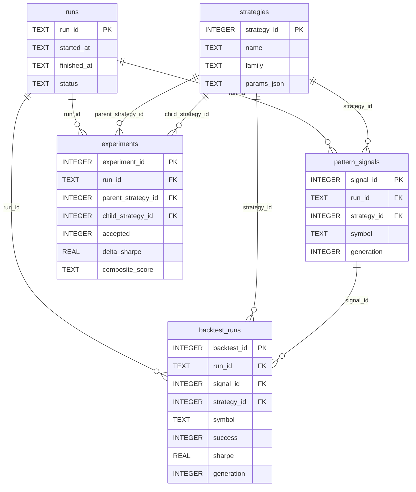

# Storage Layer — `src/atforge/storage/`

## What this module does

Single source of truth for all pipeline results. Persists runs, strategies, pattern signals, backtest results, and experiment (ratchet verdict) history to a local SQLite database.

---

## SQLite configuration

Three PRAGMAs set in `db.py::_configure_connection` on every connection:

| PRAGMA | Value | Why |
|---|---|---|
| `journal_mode` | `WAL` | Concurrent reads while pipeline writes — dashboard + pipeline run simultaneously without locking |
| `foreign_keys` | `ON` | Enforces FK constraints (`backtest_runs.strategy_id → strategies.strategy_id`) |
| `synchronous` | `NORMAL` | Safe crash recovery with ~2× write throughput vs `FULL` |

---

## Schema — all 5 tables

### `runs`

One row per `graph.invoke()` call.

| Column | Type | Notes |
|---|---|---|
| `run_id` | TEXT PK | 12-char hex (uuid4().hex[:12]) |
| `started_at` | TEXT | ISO-8601 timestamp |
| `finished_at` | TEXT | NULL until `finish_run()` called |
| `status` | TEXT | `running` → `success` / `partial` / `failed` |
| `universe_hash` | TEXT | hash of symbol list |
| `notes` | TEXT | failure summary or notes |

### `strategies`

Deduped strategy registry — same config across runs/generations = 1 row.

| Column | Type | Notes |
|---|---|---|
| `strategy_id` | INTEGER PK | autoincrement |
| `name` | TEXT | human-readable, e.g. `RSI_14_reclaim_30` |
| `family` | TEXT | `indicator` / `candlestick` / `composition` |
| `params_json` | TEXT | `json.dumps(config, sort_keys=True)` — **sort_keys=True is mandatory** |
| `description` | TEXT | optional long description |
| UNIQUE | `(name, params_json)` | dedup constraint — upsert is idempotent |

> **`sort_keys=True` is critical.** The UNIQUE constraint compares JSON strings byte-for-byte. Key ordering must be deterministic or `{"fast":5,"slow":20}` and `{"slow":20,"fast":5}` register as two different strategies.

### `pattern_signals`

One row per (run × strategy × symbol × generation) combination.

| Column | Type | Notes |
|---|---|---|
| `signal_id` | INTEGER PK | autoincrement |
| `run_id` | TEXT FK → runs | |
| `strategy_id` | INTEGER FK → strategies | |
| `symbol` | TEXT | e.g. `RELIANCE` |
| `n_signals` | INTEGER | number of True days in signal Series |
| `first_date` | TEXT | ISO date of first signal |
| `last_date` | TEXT | ISO date of last signal |
| `generation` | INTEGER DEFAULT 0 | **Phase 2a** — generation that produced this signal |
| `created_at` | TEXT | ISO-8601 timestamp |

### `backtest_runs`

One row per backtest result. Money stored as TEXT to avoid float precision loss.

| Column | Type | Notes |
|---|---|---|
| `backtest_id` | INTEGER PK | autoincrement |
| `run_id` | TEXT FK → runs | |
| `signal_id` | INTEGER FK → pattern_signals | |
| `strategy_id` | INTEGER FK → strategies | |
| `symbol` | TEXT | |
| `success` | INTEGER | 0 or 1 |
| `reason` | TEXT | failure reason if success=0 |
| `n_trades` | INTEGER | |
| `total_return` | TEXT | **str(Decimal)** — e.g. `"0.1523"` |
| `final_value` | TEXT | **str(Decimal)** |
| `max_drawdown` | TEXT | **str(Decimal)** — negative value |
| `init_cash` | TEXT | **str(Decimal)** |
| `sharpe` | REAL | ratio — float OK (analytical) |
| `sortino` | REAL | ratio — float OK |
| `cagr` | REAL | ratio |
| `win_rate` | REAL | ratio |
| `hold_bars` | INTEGER | |
| `fees` | REAL | |
| `slippage` | REAL | |
| `generation` | INTEGER DEFAULT 0 | **Phase 2a** — which generation this backtest belongs to |
| `created_at` | TEXT | |

> **Money columns (total_return, final_value, max_drawdown, init_cash) are TEXT.** Round-trip: `str(Decimal)` in, `Decimal(row["total_return"])` out. Never cast to float — float accumulates ₹100+ error on a ₹10L portfolio over thousands of trades.

### `experiments`

Ratchet verdict log — one row per mutation attempt. Written by `ratchet_node`.

| Column | Type | Notes |
|---|---|---|
| `experiment_id` | INTEGER PK | autoincrement |
| `run_id` | TEXT FK → runs | |
| `generation` | INTEGER | child's generation (ratchet fires on gen N, parent from gen N-1) |
| `parent_strategy_id` | INTEGER FK → strategies | |
| `child_strategy_id` | INTEGER FK → strategies | |
| `mutator` | TEXT | `"param_delta"` or `"composition"` |
| `mutation_json` | TEXT | full child `DetectorConfig` as JSON |
| `accepted` | INTEGER | 0 or 1 — ratchet verdict |
| `delta_sharpe` | REAL | child.mean_sharpe − parent.mean_sharpe |
| `composite_score` | TEXT | JSON blob — all 7 ratchet component scores |
| `reasoning` | TEXT | human-readable rejection reason(s) |
| `created_at` | TEXT | |

`composite_score` example:
```json
{
  "delta_sharpe": 2.148,
  "delta_sortino": 1.9,
  "dd_ratio": 1.05,
  "child_n_trades": 1.0,
  "sharpe_ok": 1.0,
  "sortino_ok": 1.0,
  "dd_ok": 1.0,
  "trades_ok": 0.0,
  "symbol_ok": 1.0,
  "worst_symbol_regression": 0.0
}
```

### `strategy_search` (FTS5 virtual table)

Full-text search over strategy names and descriptions. Maintained automatically via triggers.

---

## ER Diagram



---

## Repository functions (`repo.py`)

### Write functions

| Function | Signature | What it does |
|---|---|---|
| `insert_run` | `(conn, run_id, universe_hash=None)` | Create run row with `status='running'` |
| `finish_run` | `(conn, run_id, status, notes=None)` | Update status + `finished_at` timestamp |
| `upsert_strategy` | `(conn, name, family, params, description=None)` | INSERT OR IGNORE, always returns `strategy_id` |
| `insert_pattern_signal` | `(conn, run_id, strategy_id, symbol, n_signals, first_date, last_date, generation=0)` | Signal metadata row |
| `insert_backtest_result` | `(conn, run_id, signal_id, strategy_id, result, hold_bars, fees, slippage, init_cash, generation=0)` | Full BacktestResult to DB |
| `insert_experiment` | `(conn, *, run_id, generation, parent_strategy_id, child_strategy_id, mutator, mutation_json, accepted, delta_sharpe, composite_score_json, reasoning)` | Ratchet verdict row |

### Read functions

| Function | Returns | Notes |
|---|---|---|
| `top_rankings(conn, *, limit=20, run_id=None)` | `list[dict]` | Best backtest per (symbol, strategy) — **deduped** |
| `get_strategy(conn, strategy_id)` | `dict \| None` | Single strategy row by ID |
| `get_top_strategies_for_generation(conn, *, run_id, generation, limit=10)` | `list[dict]` | Top-N parents for mutators — AVG metrics per strategy |
| `get_experiments_for_run(conn, run_id)` | `list[dict]` | All ratchet verdicts with strategy names (JOIN strategies) |
| `get_best_sharpe_per_generation(conn, run_id)` | `list[dict]` | MAX(sharpe) per generation — powers dashboard progression chart |
| `get_strategy_children(conn, parent_strategy_id, *, accepted_only=True)` | `list[dict]` | Child strategies mutated from a given parent (via `experiments`) |
| `get_pattern_symbol_breakdown(conn, strategy_id)` | `list[dict]` | Per-symbol AVG sharpe/sortino/n_trades for ONE strategy |
| `get_mutation_tree(conn, root_strategy_id, max_depth=5)` | `list[dict]` | Recursive parent→child mutation tree rooted at a strategy (A1 agent tool) |
| `get_agent_activity_summary(conn, run_id)` | `dict` | Explorer/exploiter/critic proposal + veto counts — powers Agent Activity tab |
| `get_recent_critic_verdicts(conn, run_id, limit=20)` | `list[dict]` | Recent `critic_veto` rows with verdict and reasoning |

### `top_rankings` dedup logic

Without deduplication, the same baseline strategy appears once per generation it was tested in. The window function eliminates this:

```sql
SELECT * FROM (
    SELECT b.*, s.name AS strategy_name, s.family,
           ROW_NUMBER() OVER (
               PARTITION BY b.symbol, b.strategy_id
               ORDER BY b.sharpe DESC
           ) AS rn
    FROM backtest_runs b JOIN strategies s ON s.strategy_id = b.strategy_id
    WHERE b.success = 1 [AND b.run_id = ?]
)
WHERE rn = 1
ORDER BY sharpe DESC LIMIT ?
```

Result: one row per (symbol, strategy) pair, showing the best Sharpe ever achieved by that strategy on that symbol.

---

## Connection and transaction pattern

```python
# Always use the context manager — it closes the connection
with connect(db_path) as conn:
    # Reads: no txn() needed (autocommit is off, WAL allows concurrent reads)
    rows = conn.execute("SELECT ...").fetchall()

    # Writes: always wrap in txn()
    with txn(conn):
        insert_run(conn, run_id)
        upsert_strategy(conn, ...)
```

- `connect()` uses `isolation_level=None` (manual transaction control)
- `conn.row_factory = sqlite3.Row` — rows are dict-like, access by column name
- `txn()` is a context manager: `BEGIN` on enter, `COMMIT` on exit, `ROLLBACK` on exception

---

## Migration system

`init_db(db_path)` is idempotent — safe to call every startup. It:
1. Applies schema.sql if DB is fresh (`user_version=0`)
2. Calls `apply_migrations(conn)` — checks `PRAGMA user_version` and applies pending migrations

| user_version | State | Action |
|---|---|---|
| 0 | Fresh DB | Apply `schema.sql`, set `user_version=2` |
| 1 | Phase 1 DB | Apply `0002_phase2a.sql` (adds generation + experiments columns) |
| 2 | Phase 2a DB | No-op |

Migration SQL uses `PRAGMA table_info` column-exists guards — safe to run on an already-migrated DB.

---

## Key invariants

1. **Money = TEXT** — `str(Decimal)` in, `Decimal(row_value)` out. Never `float()`.
2. **`sort_keys=True` on params_json** — UNIQUE dedup depends on stable key ordering.
3. **`init_db` is idempotent** — call it every startup, never skip.
4. **Generation flows end-to-end** — `detect_patterns` → `insert_pattern_signal(generation=)` → `insert_backtest_result(generation=)` → `build_evaluation_result(generation=)` → ratchet. Never hardcode `generation=0` in pipeline nodes.
5. **experiments.accepted** — always 0 or 1 after ratchet; NULL = ratchet hasn't fired yet.

---

## Useful direct SQL queries

```sql
-- Browse in browser
uvx datasette data/atforge.db

-- Top strategies across all runs
SELECT symbol, s.name, b.sharpe, b.generation
FROM backtest_runs b JOIN strategies s USING(strategy_id)
WHERE success=1 ORDER BY sharpe DESC LIMIT 20;

-- Accepted mutations only
SELECT * FROM experiments WHERE accepted=1 ORDER BY delta_sharpe DESC;

-- Generation breakdown for a run
SELECT generation, COUNT(*) n, SUM(success) ok
FROM backtest_runs WHERE run_id='<run_id>' GROUP BY generation;

-- Ratchet rejection breakdown
SELECT reasoning, COUNT(*) n FROM experiments GROUP BY reasoning ORDER BY n DESC;

-- Composite score deep-dive
SELECT parent_strategy_id, child_strategy_id, composite_score
FROM experiments WHERE run_id='<run_id>';
```

---

## Tests

```
tests/storage/test_repo.py    — init_db idempotent, WAL mode, upsert dedup, top_rankings
                                 dedup (one row per symbol+strategy), insert/fetch round-trip,
                                 failure rows excluded from rankings, get_experiments_for_run
tests/storage/test_migrate.py — fresh DB lands at user_version=2, Phase 1 DB migrates cleanly
```
